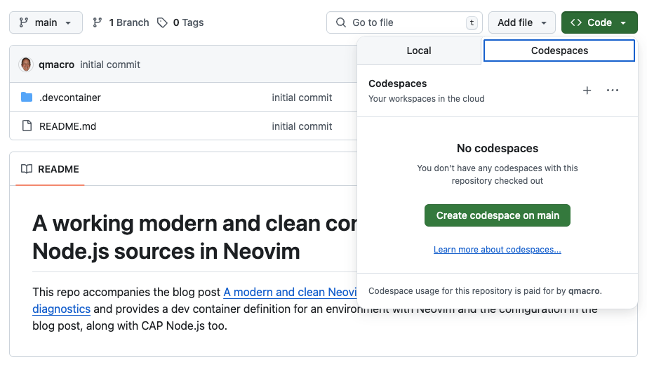

# A working modern and clean config for editing CAP Node.js sources in Neovim

This repo accompanies the blog post [A modern and clean Neovim setup for CAP Node.js - configuration and diagnostics](https://qmacro.org/blog/posts/2025/06/10/a-modern-and-clean-neovim-setup-for-cap-node.js-configuration-and-diagnostics/) and provides a dev container definition for an environment with Neovim (0.11+) and the configuration in the blog post, along with CAP Node.js too.

The idea is that you can try out what you read in the blog post by starting up a CodeSpace here on GitHub. Here's how to start up a codespace from the GitHub Web UI:



> Remember to delete your CodeSpace when you're done!

Then you can use the CodeSpace, specifically the shell that it makes available, to run Neovim and try out the features described and configured. But there's a better way.

## Trying out the Neovim config in a codespace

Instead of creating and using a codespace from the GitHub Web UI, here's an example using the [gh codespace ssh] feature. This will give you perhaps a better impression and experience, as you'll be using Neovim within a real terminal emulator, rather than one in the browser.

You'll need an account on GitHub and will need [gh], the GitHub CLI. The `gh` command offers interactive command execution, where it prompts you for input, or you can supply everything that you need via options. In this example the latter approach is taken.

> For illustration purposes, I'm using my "alternative" test GitHub user `qmacro-dev` which is separate to my main GitHub user (`qmacro`) that actually owns this repo, so you can see how the flow is for you.

### Authenticate

First, authenticate with `gh`, explicitly specifying the `codespace` scope, because this is needed to work with codespaces:

```bash
gh auth login --scope codespace
```

### Create a codespace

Once authenticated, you can create a codespace, based directly on this repo:

```bash
 gh codespace create \
  --repo qmacro/neovim-modern-clean-cap-nodejs \
  --machine basicLinux32gb \
  --retention-period 15m
```

This emits something like this:

```text
✓ Codespaces usage for this repository is paid for by qmacro-dev
glorious-lamp-gpxjgwjq5gr39r55
```

It may take a minute or two to provision, but then you can check it's there with:

```bash
gh codespace ls
```

which produces something like this:

```
NAME                   DISPLAY NAME   REPOSITORY         BRANCH  STATE      CREATED AT
glorious-lamp-gpxj...  glorious lamp  qmacro/neovim-...  main    Available  about 2 minute...
```

### Connect to the codespace via ssh

Now you can `ssh` into the codespace, using the name:

```bash
gh codespace ssh --codespace glorious-lamp-gpxjgwjq5gr39r55
```

or interactively, which will look something like this:

```bash
; gh codespace ssh
? Choose codespace:  [Use arrows to move, type to filter]
> qmacro/neovim-modern-clean-cap-nodejs [main]: glorious lamp
```

Then you're in!

```text
Linux codespaces-fbd6c7 6.8.0-1027-azure #32~22.04.1-Ubuntu SMP Thu Apr  3 20:26:27 UTC 2025 x86_64

The programs included with the Debian GNU/Linux system are free software;
the exact distribution terms for each program are described in the
individual files in /usr/share/doc/*/copyright.

Debian GNU/Linux comes with ABSOLUTELY NO WARRANTY, to the extent
permitted by applicable law.
Last login: Fri Jun 13 09:50:48 2025 from ::1
@qmacro-dev ➜ /workspaces/neovim-modern-clean-cap-nodejs (main)
```

### Try out Neovim

Now you can try out Neovim and the LSP and Tree-sitter configuration for CDS and JavaScript, as described in the [blog post] that this repo accompanies.

For example, create a new CAP Node.js project, adding some sample files like this:

```bash
cd $HOME \
  && cds init --add sample testproj \
  && cd $_
```

This should take you into `$HOME/testproj/` where you can then open e.g. `db/schema.cds` or `srv/cat-service.js` in Neovim (command is `nvim`) and test out the LSP and Tree-sitter features.

> If you are not using a font that supports the icons in the [diagnostic summary in the status line] then you can turn the icons off with `:lua require('mini.statusline').setup({ use_icons = false })`.

### Clean up

While you specified a short retention period when creating the codespace, you may wish to delete it explicitly, which you can do, like this:

```bash
gh codespace delete --codespace glorious-lamp-gpxjgwjq5gr39r55
```

---

For more on using Codespaces like this, see [Exploring codespaces as temporary dev containers], which has details on the commands used below.

---

[Exploring codespaces as temporary dev containers]: https://qmacro.org/blog/posts/2024/01/26/exploring-codespaces-as-temporary-dev-containers/
[gh codespace ssh]: https://cli.github.com/manual/gh_codespace_ssh
[gh]: https://github.com/cli/cli#installation
[blog post]: https://qmacro.org/blog/posts/2025/06/10/a-modern-and-clean-neovim-setup-for-cap-node.js-configuration-and-diagnostics/
[diagnostic summary in the status line]: https://qmacro.org/blog/posts/2025/06/10/a-modern-and-clean-neovim-setup-for-cap-node.js-configuration-and-diagnostics/#diagnostic-summary-in-the-statusline
